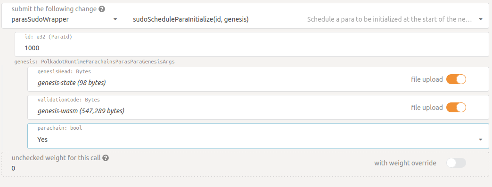

# Local Environment


Local environment includes:
- Relay chain ( rococo )
- Parachains
    - Basilisk (ID: 2090)
    - Karura (ID: 2000)
    - Westmint (ID: 1000)

Current version as of 23/01/2021 is **0.9.13**

## Basilisk and Karura

Lets setup these 2 chains using polkadot-launch tool. 

The config can be found [here](https://github.com/galacticcouncil/Basilisk-node/blob/master/rococo-local/basilisk-karura.json) 

Polkadot-launch is [here](https://github.com/paritytech/polkadot-launch)

```bash
polkadot-launch basilisk-karura.json
```

Details:

Basilisk's port: 9988

Karura's port: 9999

rococo-local-raw.json is generated in the directory where the polkadot-launch is executed from. It is needed for westmint.


## Westmint

Clone cumulus [repository](https://github.com/paritytech/cumulus.git)

Build on branch polkadot-v0.9.13

Build genesis state and wasm:
```bash
./target/release/polkadot-collator export-genesis-state --parachain-id 1000 > genesis-state

./target/release/polkadot-collator export-genesis-wasm > genesis-wasm
```

Start collator:

```bash
./target/release/polkadot-collator --collator --alice --force-authoring --tmp --ws-port 9946 -- --execution wasm --chain ../../galactic/Basilisk-node/rococo-local-raw.json --port 30335
```

### Registering as parachain

using polkadot.js , connect to relay chain and then Developer -> Sudo -> parasSudoWrapper -> scheduleParaInit.

Fill in the fields as shown:

 

